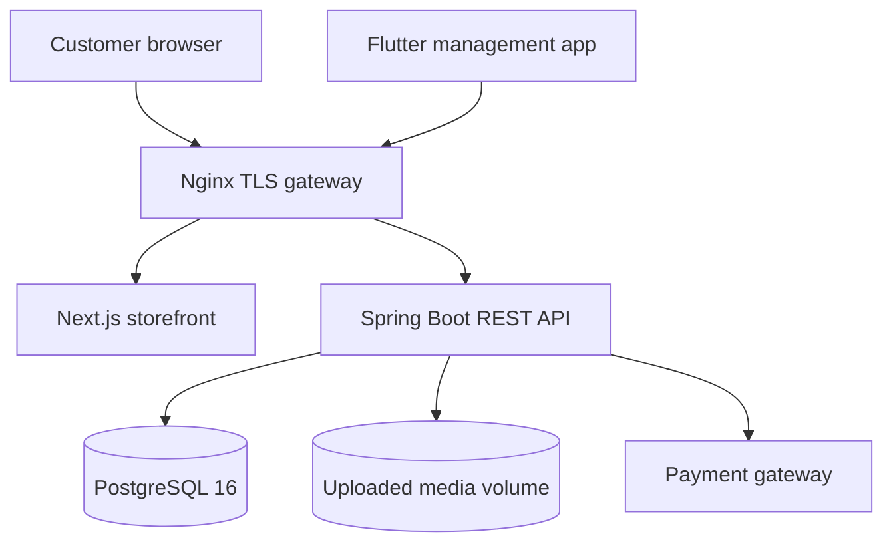
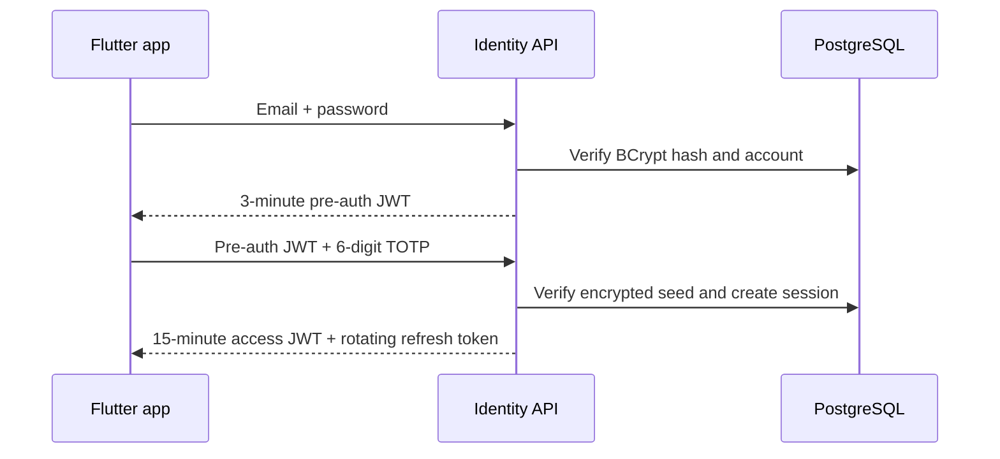
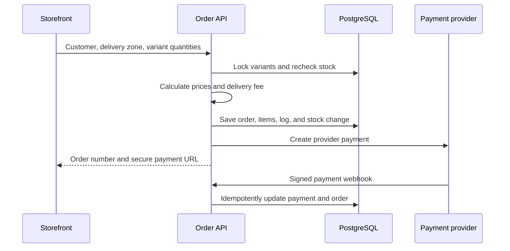
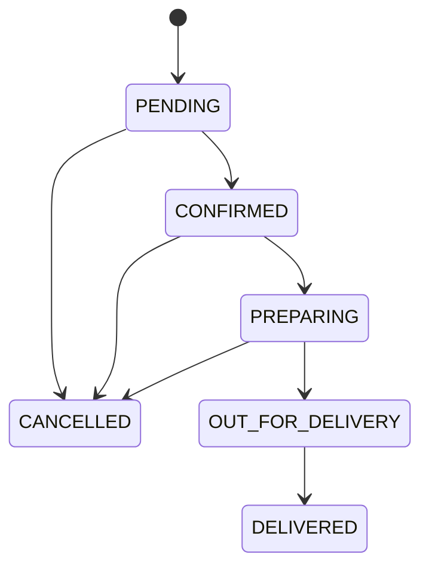

# Conception and system architecture

## 1. Purpose

Christ Béni Commerce Suite is a decoupled commerce and shop-management system for a baby and layette retailer. It joins three independently deployable applications behind one API contract:

- a customer storefront for discovery, checkout, and order tracking;
- a Flutter management application for staff operations on mobile, web, and desktop;
- a Java service that owns identity, catalogue, inventory, orders, payments, media, content, analytics, suppliers, and purchasing.

The design prioritizes safe commerce operations, clear deployment boundaries, responsive use on modest devices, and the supplied premium blurred-nature visual direction.

## 2. Architecture at a glance

Nginx is the only public container in the reference deployment. PostgreSQL, Next.js, and the API communicate through the isolated `babyshop-network`. The backend alone also joins `payment-egress` so it can contact the configured payment provider.

## 3. Application responsibilities

| Component | Owns | Does not own |
| --- | --- | --- |
| Next.js storefront | Presentation, local cart state, filters, graceful catalogue fallback, checkout submission, public tracking | Prices, final totals, stock truth, payment confirmation |
| Flutter manager | Staff workflows, media preparation, secure native token storage, foreground live-order alerts | Authorization policy, inventory truth, payment state |
| Spring Boot API | Business rules, authorization, pricing, stock, order state, payment verification, CMS, analytics | Public page rendering |
| PostgreSQL | Durable transactional state and constraints | Uploaded image bytes |
| Uploaded-media volume | Validated image bytes | Metadata and business references |
| Nginx | TLS, routing, proxy rate limits, headers, static uploaded-media delivery | Authentication and business authorization |

## 4. Brand and interaction system

The supplied Christ Béni artwork is treated strictly as the logo. It appears in navigation, footer, staff sign-in, management navigation, and application icon contexts. It is never stretched into a background, repeated as decoration, or composited into product photography.

The supplied blurred nature photograph provides atmospheric backgrounds. Frosted white layers, soft blue and pink radial light, rounded 24–40 px geometry, fine grain, and slate typography create the premium-blur direction. Product photography stays sharp so the atmosphere never hides merchandise.

The storefront adds:

- global Lenis scrolling;
- GSAP ScrollTrigger reveal and parallax behavior;
- reduced-motion support;
- blur-to-focus category interactions;
- a magnetic primary hero action;
- responsive cart, catalogue, tracking, and MFA surfaces.

## 5. Backend bounded contexts

| Context | Main responsibilities |
| --- | --- |
| Identity | Password authentication, TOTP, JWT issuance, refresh rotation, logout, staff provisioning |
| Catalogue | Categories, products, variants, filtering, featured-item maximum, product images |
| Orders | Server-side totals, locked stock deduction, fulfillment transitions, delivery assignment, private tracking |
| Payments | Gateway initiation, HMAC callback verification, event idempotency, payment-to-order state sync |
| Media and site | Signature-checked uploads, content settings, category covers, promotional text |
| Analytics | Daily revenue, new orders, active visitors, low-stock list, 30-day category traffic and sales |
| Supply | Suppliers, purchase orders, receipts, automatic stock increments |
| Notifications | Authenticated server-sent events for newly committed orders |

Controllers expose transport contracts, services enforce business policy, repositories isolate persistence, and Flyway migrations define the database as code.

## 6. Core data model

| Aggregate | Important relations and invariants |
| --- | --- |
| `User` | Unique email and phone; one role; staff roles require an encrypted TOTP seed |
| `Category` | Unique slug and display order; optional hero image |
| `Product` | Belongs to a category; unique slug; base price; active and featured flags |
| `ProductVariant` | Belongs to a product; unique SKU; dimensions and stock; optimistic version |
| `CustomerOrder` | Optional customer account; immutable order number; items, totals, delivery and payment state |
| `Payment` | One per order; unique provider reference and last event ID |
| `PurchaseOrder` | Supplier, creator, status, expected date, and receipt lines |
| `SiteSetting` | Controlled JSON values for approved public content keys |
| `MediaAsset` | Metadata for a UUID-renamed file stored outside executable paths |

PostgreSQL enums constrain roles, order statuses, and payment statuses. Database checks reject negative prices, negative stock, invalid receipt quantities, and empty order quantities.

### Database lifecycle

Docker Compose creates the database and application role from `POSTGRES_DB`, `POSTGRES_USER`, and `POSTGRES_PASSWORD`. Spring connects through the private Compose service name `postgres-db`, never through a public database address. A PostgreSQL health check gates backend startup, and Flyway validates and applies the ordered SQL files in `backend/src/main/resources/db/migration` before Hibernate validates its entity mappings.

The named `postgres-data` volume keeps rows across ordinary container recreation. The local-only Compose override publishes PostgreSQL on host loopback for development tools and publishes the API for the browser and Android emulator. Mobile and web clients communicate only with Spring Boot; they never hold database credentials or connect directly to PostgreSQL.

## 7. Authentication and authorization

### Staff login

Every non-customer role requires TOTP on every login. Native Flutter builds retain the access token and refresh cookie in secure storage. Web clients receive the refresh token only through an HttpOnly, Secure, SameSite cookie.

Method-level role checks limit sensitive areas. Super administrators can create staff. Store managers and super administrators manage catalogue, content, purchasing, and analytics. Delivery staff are routed to order fulfillment and cannot access management-only API methods.

### Token lifecycle

- Access token: 15 minutes.
- Pre-authentication token: 3 minutes and accepted only by the TOTP stage.
- Refresh token: 7 days, server-side hash, one-time rotation, and revocation on logout.
- JWT signing and TOTP encryption use independent keys.

## 8. Checkout and payment flow

The browser never supplies a trusted price or total. Variant rows are locked in deterministic ID order to reduce deadlocks. The API verifies availability, calculates the delivery fee, decrements stock, and records a snapshot of product name, SKU, and unit price.

Payment initiation never fabricates success. If provider configuration or connectivity fails, the order remains visible with an explicit failed payment state. Provider callbacks are accepted only when their HMAC-SHA256 signature matches the exact raw body. Duplicate event IDs are ignored.

## 9. Order state model

A Mobile Money order cannot move to `CONFIRMED` until its payment is `PAID`. Cancellation restores stock. Each state change creates a delivery log, and public tracking reveals only the order number, current state, payment state, update time, and delivery estimate after the order number and phone match.

## 10. Catalogue, CMS, and media

The API is the catalogue source of truth. The storefront includes a curated local fallback so a temporary API outage does not leave the customer with an empty visual experience; checkout still requires the API and revalidates all data.

The Flutter studio can capture or select a photo, correct its orientation, crop it to a square, resize it to 1600 px, encode it as JPEG, upload it, and assign it as a category cover. The server accepts only JPEG, PNG, or WebP up to 12 MiB, checks file signatures, discards the supplied storage name, and writes a UUID name to a non-executable volume.

Only `promo_banner`, `delivery_zones`, and `home_message` are writable site settings. The featured-item operation uses a PostgreSQL advisory transaction lock so concurrent editors cannot exceed four active “Coups de cœur”.

## 11. Analytics and live alerts

Anonymous visitor IDs are generated in the browser and SHA-256 hashed before persistence. Heartbeats expire from the active view after five minutes. Category events feed 30-day traffic metrics; paid order lines feed category sales.

After an order transaction commits, Spring publishes an `OrderCreatedEvent`. Authenticated native and desktop management clients receive it through an SSE stream. The Nginx route disables buffering and the Flutter listener reconnects with bounded exponential backoff. Flutter Web uses a low-frequency authenticated compatibility poll because browser adapters cannot reliably expose a never-ending response stream. Alerts are emitted only after commit, so staff never see a rolled-back order.

## 12. Security controls

| Risk | Control |
| --- | --- |
| Password compromise | BCrypt cost 12 and mandatory staff TOTP |
| Token theft | Short access lifetime, encrypted/HttpOnly storage, hashed rotating refresh sessions |
| Privilege escalation | URL policy plus method-level RBAC |
| Forged payment callback | Constant-time HMAC-SHA256 comparison and unique event IDs |
| Price or stock tampering | Server-only calculations, database constraints, pessimistic stock locks |
| Brute force or abuse | Application and Nginx rate limits with bounded per-client bucket storage |
| XSS and clickjacking | CSP, content-type, frame, referrer, and permissions headers |
| SQL injection | Parameterized Spring Data/JdbcTemplate operations; no concatenated user SQL |
| Malicious upload | Type allowlist, size limit, signature inspection, UUID filename, separate volume |
| Secret exposure | Environment injection, no committed runtime secrets, documented rotation |

## 13. Resilience and consistency

- PostgreSQL transactions wrap every state-changing business operation.
- Stock-changing reads use pessimistic locks; product variants also carry an optimistic version.
- Payment network I/O occurs outside the seed database transaction and is reconciled in a second transaction.
- Webhook processing is idempotent.
- The storefront degrades to a read-only curated catalogue when the API is unavailable.
- SSE clients reconnect automatically; a disconnected alert channel does not block order creation.
- Containers use health checks, read-only filesystems where practical, non-root users, and persistent named volumes.

## 14. Extension points

- Implement a provider-specific adapter in `PaymentGatewayClient` if its payload differs from the neutral request/response contract.
- Add an email or SMS factor behind the identity service without changing catalogue or order contexts.
- Replace the in-process notification broadcaster with Redis or a message broker before horizontally scaling the API.
- Move media bytes to S3-compatible object storage while retaining `MediaAsset` metadata.
- Add tax, coupon, and multi-currency policies behind server-side pricing services.

Deployment procedures and operational checks are defined in `docs/DEPLOYMENT.md`.
