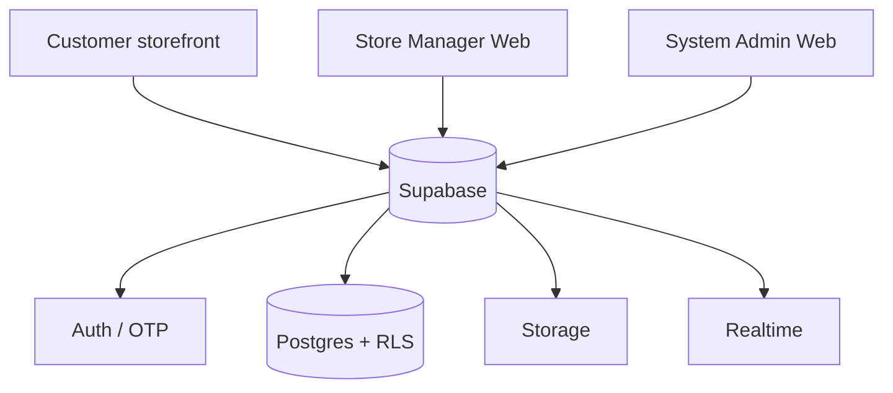

# Conception — Supabase frontend architecture

## Purpose

Christ Béni Commerce Suite is now three independently deployable web frontends connected directly to one Supabase project. Supabase owns authentication, PostgreSQL data, Row Level Security, Storage, Realtime and transactional RPC functions.

## Applications

### Storefront
- public catalogue and category discovery;
- cart and checkout;
- Supabase email/SMS OTP account creation and login;
- customer profile and authenticated order history;
- private public-order tracking using order number + phone;
- realtime catalogue refresh and anonymous visitor analytics.

### Store Manager Web
Replaces the former Flutter management application with a responsive web workspace:
- dashboard / daily KPIs;
- catalogue CRUD;
- detailed article descriptions;
- product photos in Supabase Storage;
- price, age, size, gender, colour, stock, low-stock threshold and featured state;
- order/payment workflow;
- suppliers and purchasing model;
- controlled storefront content;
- realtime new-order refresh.

### System Admin Web
Separate developer/operator surface:
- user and role management;
- manager provisioning by role promotion;
- global catalogue supervision;
- order supervision;
- application settings and audit logs;
- security/architecture visibility.

## Identity and roles

All users authenticate with Supabase OTP. `profiles.role` is one of `customer`, `store_manager`, `system_admin`. New accounts always start as `customer`. Users cannot promote themselves; role changes are performed through a security-definer function that checks the current caller is `system_admin`.

## Commerce integrity

The browser never controls final pricing or stock. `create_order` runs inside Supabase Postgres and:
1. validates the delivery zone;
2. locks each product row;
3. checks active status and stock;
4. calculates price from database values;
5. creates the order and immutable line snapshots;
6. decrements stock and records inventory movements.

Order transitions follow the original state model: `PENDING → CONFIRMED → PREPARING → OUT_FOR_DELIVERY → DELIVERED`, with cancellation allowed before delivery. Cancellation restores stock.

## Media

The `product-images` Supabase Storage bucket is public for product delivery but only manager/admin roles may upload, update or delete files. The frontends accept JPEG, PNG and WebP up to the bucket limit configured in migration SQL.

## Payments

Payment secrets never belong in a frontend. Mobile Money orders remain `PENDING` until a provider-specific Supabase Edge Function or webhook integration updates payment state. This preserves the original conception rule that payment success is never fabricated by the client.

## Visual system

The customer site keeps the original blurred nature artwork as atmosphere and the supplied Christ Béni artwork as the logo. Blue, pink, white glass layers, rounded geometry and richer ambient animation are retained and expanded. Store Manager uses a bright operational design; System Admin uses a dark developer-oriented control surface.
